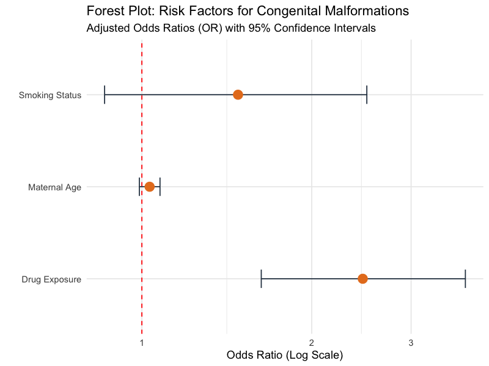

# Quantitative Safety & Pharmacovigilance Data Pipeline (R & Python)

This repository contains operational data science workflows developed to automate and optimize Pharmacovigilance (PV) processes. The core focus is translating raw, unstructured post-marketing surveillance data into validated safety insights, strictly aligned with European Medicines Agency (EMA) Good Pharmacovigilance Practices (GVP) and ICH guidelines.

---

##  Project 1: Signal Detection & Disproportionality Testing (PRR Engine)
**Tech Stack:** R (`httr`, `jsonlite`, `tidyverse`)  
**Regulatory Framework:** EMA GVP Module IX & FDA Guidance for Industry.

###  Executive Summary
Automated ingestion of raw safety reports from the openFDA endpoint (`drug/event.json`) to establish a standardized data cleaning pipeline. Built a quantitative data mining tool utilizing the Proportional Reporting Ratio (PRR) algorithm to flag potential safety signals.

###  Adverse Event Profiling
Distribution of the top 15 reported clinical outcomes processed during the extraction phase:

###  Methodological Discussion & Signal Evaluation
* **Active Control Benchmarking:** Evaluated **Ibuprofen** against an active control (**Acetaminophen**) specifically filtering for **Acute Kidney Injury** (MedDRA Preferred Term).
* **Statistical Validation:** The pipeline automatically structured a 2x2 contingency table. The analysis yielded a **PRR Score of 1.54**. 
* **Regulatory Decision-Making:** Per international criteria, a safety signal requires a $PRR \ge 2$ and $\ge 3$ cases. Although Ibuprofen showed a 54% higher proportion of renal reports relative to the control, it did not cross the threshold for a valid signal. Implementing active controls in this pipeline successfully prevented a false-positive escalation, showcasing the necessity of data-driven signal triaging.

---

##  Project 2: Production-Ready Serious Adverse Event Alerting (Python)
**Tech Stack:** Python 3 (`requests`, `pandas`)  
**Regulatory Framework:** Real-Time Safety Screening & Case Ingestion Triage.

###  Executive Summary
A backend Python script designed to monitor safety data streams for high-priority molecules. This script automates the continuous screening of safety databases to expedite the triage of high-risk case reports.

###  Operational Impact
* **Targeted Ingestion:** Queries and filters openFDA data in real time, specifically isolating **Serious Adverse Events (SAEs)** (defined by regulatory criteria: hospitalization, life-threatening outcomes, or death) for **Metformin**.
* **Workflow Automation:** Utilizes Pandas to parse nested JSON payloads, compute the exact percentage contribution of each distinct MedDRA term, and output a structured, clean data summary. This script replaces manual query routines, significantly reducing the Time-to-Triage for safety analysts.

---

##  Project 3: Time-to-Onset Risk Profiling (Kaplan-Meier Survival Analysis)
**Tech Stack:** R (`survival`, `survminer`)  
**Regulatory Framework:** ICH E2A Guidelines & WHO-UMC Causality Assessment Criteria.

###  Executive Summary
Applied survival analysis methodologies to evaluate the temporal plausibility of an adverse drug reaction (ADR). This project models the exact timeline from initial drug exposure to the first documented onset of a suspected reaction, comparing risk profiles across demographics.

###  Time-to-Onset Risk Curves
Survival distribution showing the probability of a patient remaining free from the targeted ADR over the course of treatment:

###  Clinical & Regulatory Discussion
* **Comparative Cohorts:** Analyzed risk progression between special populations (**Adults vs. Elderly**). The Log-Rank test indicated no statistically significant difference in onset times between the cohorts ($p = 0.3$).
* **Risk Minimization:** Mapping the high-risk temporal window (where the curve drops) provides empirical data for the Risk Management Plan (RMP). This statistical evidence supports precise definitions for product labeling updates, specifically core safety profile revisions.

---

##  Project 4: Teratovigilance & Confounder Control (Multivariate Logistic Regression)
**Tech Stack:** R (`tidyverse`, `broom`)  
**Regulatory Framework:** EMA GVP Module P.III (Special Populations: Pregnant & Breastfeeding Women).

###  Executive Summary
An epidemiological data workflow tailored for pregnancy registries. The project evaluates rare outcomes (congenital malformations) following gestational drug exposure, utilizing multivariate logistic regression to isolate the true drug effect from confounding maternal factors.

###  Adjusted Odds Ratio Profile (Forest Plot)
Visual representation of adjusted risk metrics used to support benefit-risk balance determinations:

###  Methodological Discussion
* **Confounder Mitigation:** The model controls for maternal age and smoking status. Adjusting for these variables prevents the skewing of safety data, ensuring that the calculated signal is genuinely linked to drug exposure rather than lifestyle baselines.
* **Quantifiable Risk:** By outputting **Adjusted Odds Ratios (aOR)** alongside 95% Confidence Intervals, this script provides the statistical rigor required by European regulatory authorities when updating safety registries or deciding on post-authorization safety studies (PASS).
