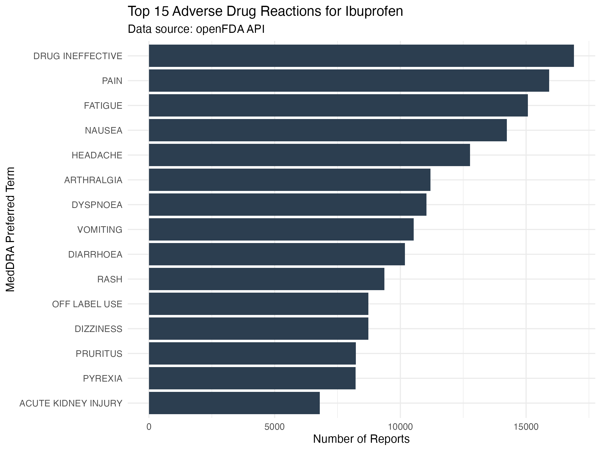
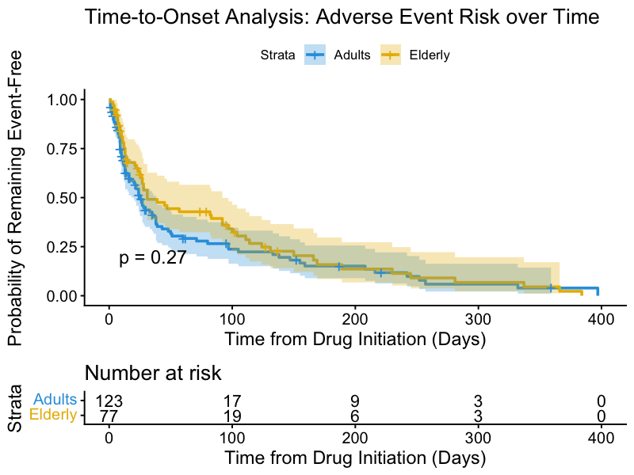

# Pharmacovigilance-Data-Science-Portifolio-R-and-Python
Data science projects applied to Pharmacovigilance, Drug Safety, and Regulatory Affairs using R and Python. Features real-time data extraction from the openFDA API
# Pharmacovigilance Data Science Portfolio: R & Python

This repository features practical data science projects demonstrating the application of programming languages in Drug Safety, Regulatory Affairs, and Patient Safety. The primary focus is turning raw health data into actionable regulatory insights.

---

## Project 1: Automated Adverse Event Data Extraction (openFDA API)

In this first module, I developed a script in **R** to connect directly with the U.S. Food and Drug Administration's official public API (**openFDA**). 

### Project Objectives:
1. Establish a secure HTTP connection with the adverse event endpoint (`drug/event.json`).
2. Query and extract real-time post-marketing surveillance data (JSON format) for a specific drug (**Ibuprofen**).
3. Perform data cleaning and transformation, converting nested JSON structures into a structured, tidy data frame.

### Tech Stack & Libraries:
* **httr**: For handling HTTP requests and API communication.
* **jsonlite**: For parsing, flattening, and converting JSON data into R data frames.
* **tidyverse**: For efficient data manipulation and syntax styling.

### Next Steps in Development:
* Implement data filtering to remove generic MedDRA terms (e.g., "Drug Ineffective").
* Generate statistical visualization (bar charts) using `ggplot2` to display the distribution of the most frequently reported Adverse Drug Reactions (ADRs).
* Calculate Disproportionality Scores (Proportional Reporting Ratio - PRR) for safety signal detection.

###  Visual Insights:
Below is the chart generated directly from the script, showcasing the distribution of the top 15 reported adverse events:

---

## Project 1 (Part 2): Safety Signal Detection & Disproportionality Analysis (PRR)

In this extension, I implemented a data mining algorithm used by regulatory agencies (such as ANVISA, FDA, and EMA) to calculate the **Proportional Reporting Ratio (PRR)**. 

### Methodological Approach:
* **Target Drug:** Ibuprofen
* **Active Control Group:** Acetaminophen (Paracetamol)
* **Adverse Event Target:** *Acute Kidney Injury* (MedDRA Preferred Term)

### Practical Outcome & Regulatory Discussion:
The script automatically queried the whole database to build a $2\times2$ contingency table, outputting a **PRR Score of 1.54**. 

According to global guidelines, a safety signal is triggered when $\text{PRR} \ge 2$ and $\text{cases} \ge 3$. Even though Ibuprofen showed a **54% higher proportion** of renal reports compared to Acetaminophen, it did not cross the statistical threshold to generate a new safety alert. This demonstrates how active controls are vital to avoid false-positive signals in post-marketing surveillance.

---

## Project 2: Automated Drug Safety Alert System (Python)

In this second project, I shifted the tech stack to **Python** to demonstrate versatility in handling regulatory data streams. 

### Project Objectives:
1. Connect to the openFDA endpoint using Python's `requests` library.
2. Query safety data specifically filtered for **Serious Adverse Events** (cases involving hospitalization, life-threatening situations, or death) for **Metformin**.
3. Use **Pandas** to structure the JSON response, calculate the percentage share of each serious reaction, and generate an automated text-based safety report.

### Tech Stack:
* **Python 3**
* **Requests**: For API interactions.
* **Pandas**: For high-performance data manipulation and tabular analysis.

* ---

---

## Project 03: Time-to-Onset Analysis (Kaplan-Meier)
**Language used:** R (`survival` and `survminer` packages)  
**Regulatory Alignment:** ICH E2A Guidelines & WHO-UMC Causality Assessment.

### Project Objective
Analysis of the time elapsed between drug initiation and the onset of a specific adverse event, evaluating biological plausibility and comparing risk dynamics between special populations (**Adults vs. Elderly**).

### Survival Curve (Generated automatically by R):
Below is the Kaplan-Meier plot generated by the statistical script, demonstrating the probability of a patient remaining event-free over the treatment period:

### Regulatory Perspective
* **Log-Rank Test:** The script automatically executes a hypothesis test to evaluate whether the difference in time-to-onset between the two cohorts is statistically significant.
* **Risk Management:** Identifying the high-risk window (where the curve drops most sharply) allows the Pharmacovigilance team to propose targeted risk minimization measures in product labeling and Risk Management Plans (RMPs).
